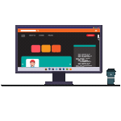

# Hey, I'm Aditya 👋

### AI & ML Student • Full-Stack Developer • Building Practical Tech Projects

---

<table>
  <tr>
    <td align="center">
      <h1>Hey, I'm Aditya 👋</h1>
      <h3>AI & ML Student • Full-Stack Developer • Building Practical Tech Projects</h3>
    </td>
    <td align="center">
      
    </td>
  </tr>
</table>

---

## About Me

I am an Artificial Intelligence and Machine Learning student interested in building real-world projects using AI, ML, web development, backend systems, and data-driven applications.

- Currently learning Machine Learning, Deep Learning, React, Node.js, Express.js, MongoDB, and API development
- Interested in AI projects, anomaly detection, computer vision, sign detection, and full-stack applications
- Building projects that combine frontend, backend, and machine learning services
- Exploring practical project development, clean UI design, intelligent automation, and deployment
- Learning by building projects, improving documentation, and solving practical problems

---

## Tech Stack

 

---

## Featured Projects

---

Anomaly Detection in Satellite Telemetry

 

A machine learning project focused on detecting abnormal patterns in satellite telemetry data.  
The project is useful for identifying unusual behavior, faults, or irregular readings in telemetry-based systems.

  

  

Main focus:

- Detecting abnormal telemetry patterns
- Understanding data behavior
- Applying machine learning models
- Evaluating model performance
- Working with real-world anomaly detection use cases

 

---

Sign Detector AI

 

An AI-based sign detection project that combines web development and machine learning concepts.  
This project focuses on detecting signs using an AI/ML-based workflow.

  

  

Main focus:

- Sign detection
- AI/ML integration
- Frontend and backend workflow
- Image-based prediction system
- Practical artificial intelligence project development

 

---

Resume Genie

 

A resume-related web project focused on helping users generate or improve resumes through a digital interface.  
This project is useful for practicing frontend development, UI design, and automation-based application logic.

  

  

Main focus:

- Resume generation
- Frontend development
- User interface design
- JavaScript-based application logic
- Building useful student-focused tools

 

---

Full-Stack Lab

 

A practice repository for learning and improving full-stack web development skills.  
This repository is useful for experimenting with frontend, backend, APIs, and database-related concepts.

  

  

Main focus:

- HTML, CSS, and JavaScript
- Responsive web development
- Backend basics
- Full-stack project structure
- Learning by implementing small practical examples

 

---

## Interactive Learning Sections

AI / ML Interests

 

- Supervised Learning
- Unsupervised Learning
- Anomaly Detection
- Computer Vision
- Sign Detection Systems
- Data Preprocessing
- Feature Engineering
- Model Evaluation
- Practical ML Project Development
- AI-powered web applications

Web Development Interests

 

- HTML, CSS, and JavaScript
- React.js
- Node.js and Express.js
- MongoDB
- REST APIs
- Authentication
- Responsive UI Design
- Full-stack project structure
- API integration
- Frontend and backend communication

Currently Learning

 

- Machine Learning algorithms
- React components, props, state, hooks, and routing
- Backend API development
- MongoDB CRUD operations
- Git and GitHub project documentation
- Deployment and hosting basics
- Clean project structure
- Building better UI/UX for projects

Project Goals

 

- Build more AI and ML projects
- Improve full-stack development skills
- Create clean GitHub documentation
- Learn deployment and hosting
- Improve problem-solving and coding skills
- Build a strong developer portfolio

---

## GitHub Stats

---

## GitHub Streak

---

## GitHub Trophies

---

## Contribution Activity

---

## Contribution Snake

---

## Connect With Me

---

### Learning by building. Improving one project at a time 🚀

