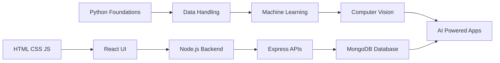

<div align="center">


<br><br>


</div>

<br>


## 🧭 Player Snapshot

<div align="center">

| Attribute | Details |
|---|---|
| 👤 Name | Aditya |
| 🎓 Domain | Artificial Intelligence & Machine Learning |
| 🧩 Role | AI + Full-Stack Project Builder |
| 🎮 Playstyle | Learn → Build → Debug → Improve |
| 🚀 Mission | Turn ideas into useful tech projects |
| 🧠 Current Stack | React, Node.js, MongoDB, APIs, Machine Learning |

</div>

<br>


## 🖥️ Boot Console

<div align="center">


<br><br>


<br><br>


</div>

<br>


## 🧬 Developer DNA

I like building practical tech projects where AI, machine learning, frontend design, backend logic, databases, and APIs work together.

My goal is to understand how real applications are made from end to end — from data and models to user interfaces and deployment-ready systems.

Every project is a new level, every bug is a mini boss, and every improvement adds XP.

<br>


## ⚡ Tech Loadout

<div align="center">


<br><br>

### 🧠 AI / ML Toolkit


<br><br>


<br><br>

### 🌐 Web Development Stack


<br><br>


<br><br>

### 🛠️ Developer Utilities


</div>

<br>


## 🧪 Project Lab

<div align="center">

| Lab Zone | What Happens Here |
|---|---|
| 🤖 AI Experiments | Training models, testing predictions, evaluating results |
| 🛰️ Anomaly Detection | Finding unusual behavior in data patterns |
| 🖐️ Computer Vision | Working with images, signs, and visual recognition |
| 🌐 Full-Stack Builds | Connecting React, Node.js, APIs, and databases |
| 🔐 Backend Systems | Handling routes, authentication, requests, and data |
| 📦 Documentation | Making repositories cleaner, clearer, and more useful |

</div>

<br>


## 🧠 Skill Radar

<div align="center">


</div>

<br>


## 🗺️ Upgrade Roadmap



<br>


## 🚀 Active Quests

<div align="center">

| Quest | Category | Progress |
|---|---|---|
| 🛰️ Satellite Telemetry Anomaly Detection | Machine Learning | Upgrading |
| 🖐️ Sign Detector AI | AI + Full Stack | Building |
| 📄 Resume Genie | Web Application | Designing |
| 🧪 Full-Stack Lab | Practice Repository | Expanding |

</div>

<br>


## 🎮 Featured Builds

<div align="center">

<a href="https://github.com/Aditya-KV/Anomaly-detection-in-satellite-telemetry">
  
</a>

<a href="https://github.com/Aditya-KV/sign-detector-ai">
  
</a>

<a href="https://github.com/Aditya-KV/resume-genie">
  
</a>

<a href="https://github.com/Aditya-KV/Full-stack-Lab">
  
</a>

</div>

<br>


## 🗂️ Quest Details

<details>
<summary>🛰️ Satellite Telemetry Anomaly Detection</summary>

<br>

A machine learning project focused on detecting abnormal patterns in satellite telemetry data.

Core focus:

- Analyze telemetry signals
- Detect unusual readings
- Compare ML models
- Evaluate prediction quality
- Understand real-world anomaly detection workflows

<br>

<a href="https://github.com/Aditya-KV/Anomaly-detection-in-satellite-telemetry">
  
</a>

</details>

<details>
<summary>🖐️ Sign Detector AI</summary>

<br>

An AI-based sign detection project that connects machine learning concepts with a full-stack application workflow.

Core focus:

- Image-based prediction
- AI/ML integration
- Frontend and backend communication
- Computer vision workflow
- Practical AI project development

<br>

<a href="https://github.com/Aditya-KV/sign-detector-ai">
  
</a>

</details>

<details>
<summary>📄 Resume Genie</summary>

<br>

A resume-focused web project for practicing interface design, frontend logic, and automation-based workflows.

Core focus:

- Resume generation flow
- Clean UI design
- JavaScript application logic
- Student-focused productivity
- Frontend development practice

<br>

<a href="https://github.com/Aditya-KV/resume-genie">
  
</a>

</details>

<details>
<summary>🧪 Full-Stack Lab</summary>

<br>

A practice repository for experimenting with frontend, backend, APIs, and database concepts.

Core focus:

- HTML, CSS, JavaScript
- Responsive layouts
- Backend basics
- API experiments
- Full-stack project structure

<br>

<a href="https://github.com/Aditya-KV/Full-stack-Lab">
  
</a>

</details>

<br>


## 💬 Dev Log / Checkpoint Room

<div align="center">


<br><br>


</div>

<br>

<div align="center">

| 🎮 Game Event | 🚀 Progress |
|---|---|
| 🐞 Bug Encountered | Confusing logic and unexpected errors |
| 🔧 Patch Applied | Practice, debugging, and better understanding |
| ⚔️ Main Weapon | Python, JavaScript, and problem-solving |
| 🧪 Side Quest | Build cleaner projects with better structure |
| 💎 XP Reward | Stronger logic, cleaner UI, better documentation |
| 🏁 Next Checkpoint | AI + Full-Stack portfolio upgrade |

</div>

<br>

<div align="center">


</div>

<br>

```txt
╔════════════════════════════════════════════════════╗
║                 SAVE FILE 01                      ║
╠════════════════════════════════════════════════════╣
║ Player        : Aditya                            ║
║ Current Mode  : Learning by Building              ║
║ Active Quest  : AI + Full-Stack Development       ║
║ Challenge     : Turn ideas into working projects  ║
║ Status        : Not perfect, but upgrading daily  ║
╚════════════════════════════════════════════════════╝
```

<div align="center">


</div>

<br>


## 📊 GitHub Dashboard

<div align="center">


</div>

<br>

<div align="center">


</div>

<br>

<div align="center">


</div>

<br>


## 📈 Activity Map

<div align="center">


</div>

<br>


## 🧊 3D Contribution Graph

<div align="center">


</div>

<br>


## 🐍 Contribution Snake

<div align="center">


</div>

<br>


## 📡 Connect Portal

<div align="center">

<a href="https://www.linkedin.com/in/your-linkedin">
  
</a>

<a href="mailto:your-email@gmail.com">
  
</a>

<a href="https://your-portfolio-link.com">
  
</a>

</div>

<br>


<div align="center">

### Building Projects. Breaking Limits. Leveling Up. 🚀


</div>


<!--
Notes:
1. Keep your GIF here: assets/mario.gif
2. Stats, badges, typing SVG, capsule animations, and activity graph should work directly.
3. The 3D Contribution Graph and Contribution Snake need GitHub Actions setup.
4. If the 3D graph or snake does not appear immediately, set up the workflows later or temporarily remove those sections.
-->
