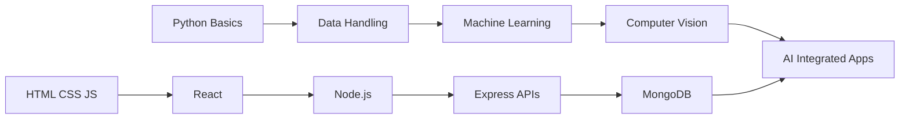

<div align="center">


<br><br>


</div>

<br>


## 🧭 Developer Snapshot

<div align="center">

| Field | Details |
|---|---|
| 👤 Name | Aditya |
| 🎓 Domain | Artificial Intelligence & Machine Learning |
| 🧩 Builder Type | AI + Full-Stack Project Developer |
| ⚙️ Working Style | Learn → Build → Break → Fix → Improve |
| 🚀 Goal | Create useful AI, ML, and web-based projects |
| 🧠 Current Focus | React, Node.js, MongoDB, APIs, Machine Learning |

</div>

<br>


## 🖥️ Neon System Console

```txt
> Initializing Aditya.exe
> Loading AI modules.................. DONE
> Loading Web Dev engine.............. DONE
> Connecting to project database...... DONE
> Activating builder mode............. DONE
> Current mission: Build, Break, Fix, Improve
```

<div align="center">


</div>

<br>


## 🧬 Core Identity

I enjoy building practical technology projects that combine machine learning, web development, backend systems, databases, APIs, and clean user interfaces.

For me, every project is not just code. It is a small experiment where I learn how frontend, backend, databases, APIs, and AI models work together in real-world applications.

<br>


## ⚡ RGB Tech Arsenal

<div align="center">


<br><br>

### 🧠 AI / ML Weapons


<br><br>


<br><br>

### 🌐 Full-Stack Gear


<br><br>


<br><br>

### 🛠️ Dev Tools


</div>

<br>


## 🧪 Current Lab Experiments

<div align="center">

| Experiment | What I Am Building / Learning |
|---|---|
| 🤖 AI Projects | ML workflows, prediction systems, model evaluation |
| 🛰️ Anomaly Detection | Detecting unusual patterns in data |
| 🖐️ Computer Vision | Image-based detection and sign recognition |
| 🌐 Full-Stack Apps | React frontend + Node backend + database |
| 🔐 Backend Systems | APIs, authentication, routing, and data handling |
| 📦 Project Documentation | Cleaner GitHub READMEs and structured repositories |

</div>

<br>


## 🧠 Skill Matrix

<div align="center">


</div>

<br>


## 🗺️ Learning Roadmap



<br>


## 🚀 Active Missions

<div align="center">

| Mission | Type | Status |
|---|---|---|
| 🛰️ Satellite Telemetry Anomaly Detection | Machine Learning | Improving |
| 🖐️ Sign Detector AI | AI + Full Stack | Building |
| 📄 Resume Genie | Web App | Designing |
| 🧪 Full-Stack Lab | Practice Repository | Expanding |

</div>

<br>


## 🚀 Featured Projects

<div align="center">

<a href="https://github.com/Aditya-KV/Anomaly-detection-in-satellite-telemetry">
  
</a>

<a href="https://github.com/Aditya-KV/sign-detector-ai">
  
</a>

<a href="https://github.com/Aditya-KV/resume-genie">
  
</a>

<a href="https://github.com/Aditya-KV/Full-stack-Lab">
  
</a>

</div>

<br>


## 🛰️ Project Console

<details>
<summary>Open Project: Anomaly Detection in Satellite Telemetry</summary>

<br>

A machine learning project focused on detecting abnormal patterns in satellite telemetry data.

Main idea:

- Analyze telemetry data
- Detect abnormal behavior
- Compare machine learning models
- Evaluate detection performance
- Understand real-world anomaly detection workflows

<br>

<a href="https://github.com/Aditya-KV/Anomaly-detection-in-satellite-telemetry">
  
</a>

</details>

<details>
<summary>Open Project: Sign Detector AI</summary>

<br>

A sign detection project combining AI concepts with a full-stack workflow.

Main idea:

- Image-based prediction
- AI/ML integration
- Frontend and backend communication
- Practical computer vision workflow
- Real-time project-based learning

<br>

<a href="https://github.com/Aditya-KV/sign-detector-ai">
  
</a>

</details>

<details>
<summary>Open Project: Resume Genie</summary>

<br>

A resume-focused web project for practicing UI design, frontend logic, and automation-based application development.

Main idea:

- Resume generation workflow
- Clean interface design
- JavaScript application logic
- Student-focused productivity tool
- Frontend development practice

<br>

<a href="https://github.com/Aditya-KV/resume-genie">
  
</a>

</details>

<details>
<summary>Open Project: Full-Stack Lab</summary>

<br>

A practice repository for learning frontend, backend, APIs, and database concepts.

Main idea:

- HTML, CSS, JavaScript practice
- Responsive layouts
- Backend basics
- API experiments
- Full-stack project structure

<br>

<a href="https://github.com/Aditya-KV/Full-stack-Lab">
  
</a>

</details>

<br>


## 💬 Developer Log

```txt
Error: Skill limit not found
Fix: Keep learning, building, and debugging
Status: Still compiling...
```

<div align="center">


</div>

<br>


## 📊 GitHub Dashboard

<div align="center">


</div>

<br>

<div align="center">


</div>

<br>

<div align="center">


</div>

<br>


## 📈 Activity Graph

<div align="center">


</div>

<br>


## 🧊 3D Contribution Graph

<div align="center">


</div>

<br>


## 🐍 Contribution Snake

<div align="center">


</div>

<br>


## 📡 Connect

<div align="center">

<a href="https://www.linkedin.com/in/your-linkedin">
  
</a>

<a href="mailto:your-email@gmail.com">
  
</a>

<a href="https://your-portfolio-link.com">
  
</a>

</div>

<br>


<div align="center">

### Building. Debugging. Learning. Repeating.


</div>


<!--
Note:
The normal stats, badges, typing SVG, activity graph, and capsule animations will work directly.

The 3D Contribution Graph and Contribution Snake need GitHub Actions setup.
If they do not appear immediately, remove these sections or set up their workflows later.
-->
