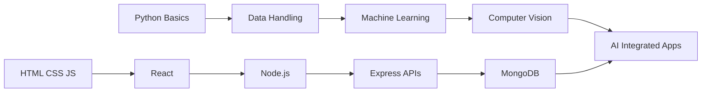

# 🕹️ Aditya.exe

### AI & ML Learner • Full-Stack Builder • Project-Based Developer

  

---

## 🧭 Developer Snapshot

| Field | Details |
|---|---|
| 👤 Name | Aditya |
| 🎓 Domain | Artificial Intelligence & Machine Learning |
| 🧩 Builder Type | Full-Stack + AI Project Developer |
| ⚙️ Working Style | Learn → Build → Break → Fix → Improve |
| 🚀 Goal | Create useful AI, ML, and web-based projects |
| 🧠 Current Focus | React, Node.js, MongoDB, APIs, Machine Learning |

---

## 🧬 Core Identity

I enjoy building practical technology projects that combine machine learning, web development, backend systems, and clean user interfaces.

For me, every project is not just code. It is a small experiment where I learn how frontend, backend, databases, APIs, and AI models work together in the real world.

---

## 🧰 Tech Arsenal

### Languages

  

### Frontend

  

### Backend & Database

  

### Tools

---

## 🧪 Current Lab Experiments

| Experiment | What I Am Building / Learning |
|---|---|
| 🤖 AI Projects | ML workflows, prediction systems, model evaluation |
| 🧠 Anomaly Detection | Detecting unusual patterns in data |
| 🖐️ Computer Vision | Image-based detection and sign recognition |
| 🌐 Full-Stack Apps | React frontend + Node backend + database |
| 🔐 Backend Systems | APIs, authentication, routing, and data handling |
| 📦 Project Documentation | Cleaner GitHub READMEs and structured repositories |

---

## 🧠 Skill Matrix

---

## 🗺️ Learning Roadmap

---

## 🚀 Featured Projects

---

## 🛰️ Project Console

Open Project: Anomaly Detection in Satellite Telemetry

 

A machine learning project focused on detecting abnormal patterns in satellite telemetry data.

Main idea:

- Analyze telemetry data
- Detect abnormal behavior
- Compare machine learning models
- Evaluate detection performance
- Understand real-world anomaly detection workflows

 

Open Project: Sign Detector AI

 

A sign detection project combining AI concepts with a full-stack workflow.

Main idea:

- Image-based prediction
- AI/ML integration
- Frontend and backend communication
- Practical computer vision workflow
- Real-time project-based learning

 

Open Project: Resume Genie

 

A resume-focused web project for practicing UI design, frontend logic, and automation-based application development.

Main idea:

- Resume generation workflow
- Clean interface design
- JavaScript application logic
- Student-focused productivity tool
- Frontend development practice

 

Open Project: Full-Stack Lab

 

A practice repository for learning frontend, backend, APIs, and database concepts.

Main idea:

- HTML, CSS, JavaScript practice
- Responsive layouts
- Backend basics
- API experiments
- Full-stack project structure

 

---

## 📊 GitHub Dashboard

---

## 🔥 Contribution Streak

---

## 🏆 Trophy Room

---

## 📈 Activity Graph

---

## 🐍 Contribution Snake

---

## 📡 Connect

---

### Building. Debugging. Learning. Repeating.

